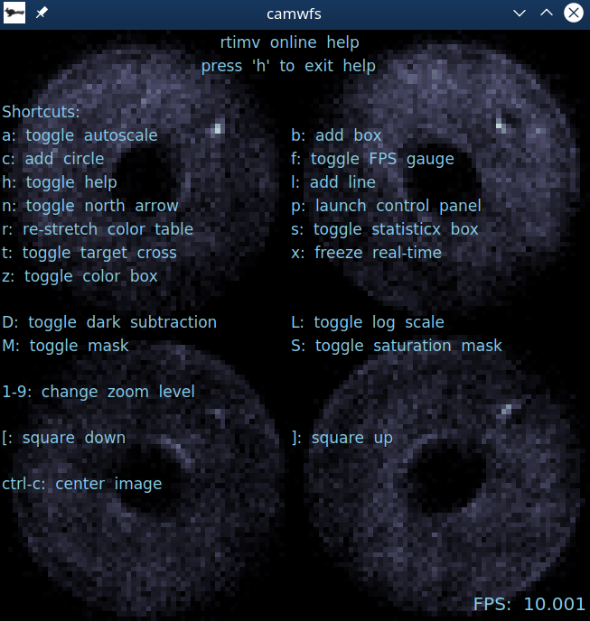
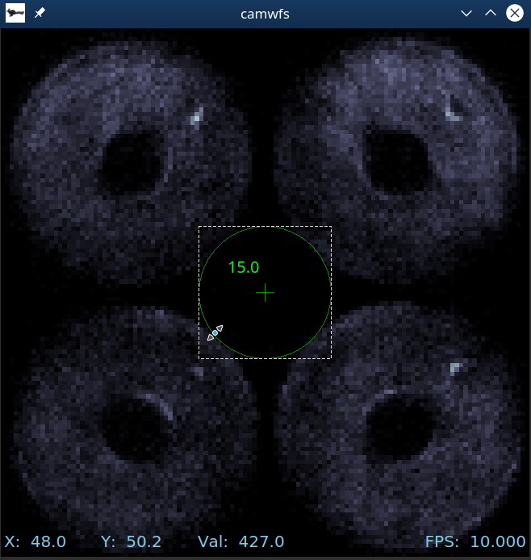

# rtimv

An image viewer optimized for real-time image stream display. Works with MILK/CACAO shared memory image streams.

## Basic Startup
The basic way to start `rtimv` is to provide a list of stream names:
```
$ rtimv image dark mask sat_mask
```
where each of the streamn names corresponds to an image, e.g. `image` => `/milk/shm/image.im.shm` but note that you only pass `image`.  Order matters in this list, and it must be the last thing on the command line (after any options).

These (and many more) can also be specified in a configuration file, or with named command line options, as detailed below under [Configuration](#Configuration).

For a camera named `camname` with an existing configuration file, start `rtimv` with

```
$ rtimv -c camname
```

## Operating rtimv

rtimv lets you adjust color scales and draw shapes for interactive measurement of image features with keyboard shortcuts.

To access the help screen, type `h` after opening rtimv. The [keyboard shortcuts](#Keyboard-Shortcuts) are just the letters shown (without `ctrl` or `alt`) unless noted.



To add a circle, type `c`. You can drag to resize or reposition, and hit the `delete` key to remove. The number shown is the radius in pixels. (You can add another circle by hitting `c` again.)



The `b` key adds a box, which works similarly. Dimensions shown are full-width by full-height.


You can also use `l` to add a line. The numbers shown are `length @ direction` where direction is degrees from the screen +X direction. (This will eventually be degrees from the North vector.)


### Keyboard Shortcuts

| Key     | Action                            | Description      |
|---------|-----------------------------------|------------------|
| `a`     | toggle autoscale                  | autoscale on will update the color table for each imge|
| `b`     | add a box                   | draw a box overlay and show its full width and height |
| `c`     | add a circle                | draw a circle overlay and show its radius |
| `f`     | toggle the FPS gauge               | |
| `h`     | toggle help screen               | |
| `l`     | add a line               | draw a line overlay and show its length and angle |
| `n`     | toggle display of the North arrow | |
| `p`     | open control panel                | |
| `o`     | toggle display of the circle      | |
| `r`     | re-stretch the display            | reset the min/max in the color table using the current image |
| `s`     | toggle the statistics box         | |
| `t`     | toggle the target cross           | |
| `x`     | freeze the display                | stop updating until `x` is pressed again |
| `z`     | toggle color box                   | the yellow box used for changing the color table limits based on the values inside it |
| `D`     | toggle dark subtraction           | |
| `L`     | toggle log scale                  | |
| `M`     | toggle the mask                   | |
| `S`     | toggle the sat-mask               | |
| `1`-`9` | change the zoom level             | |
| `[`     | fit gui to image, decreasing size | |
| `]`     | fit gui to image, increasing size | |
| `ctrl+c`     | center the display                | |


### Pixel Conventions

The displayed coordinate is for the center of a pixel, counting from `0,0` for the center of the lower left pixel.  The center of the array (and default target-cross coordinate) is `0.5*(Nx-1), 0.5*(Ny-1)`.


## Configuration

```
$ rtimv --image.shmim_name=image --dark.shmim_name=dark --mask.shmim_name=mask --satMask.shmim_name=sat_mask
```
or with a configuration file
```
rtimv -c config_file.conf 
```
where the options would be specified in the file as
```
[image]
shmim_name=image 

[dark]
shmim_name=dark

[mask]
shmim_name=mask

[satMask]
shmim_name=sat_mask
```
Many more options are available.

### Configuration Options
| Short | Long              | Config-File*         | Type          | Description |
|-------|-------------------|----------------------|---------------|-----------|
| `-h`  | `--help`          |                      | bool          | Print a help message and exit |
| `-c`  | `--config`        | `config`             | string        | A local config file |
|        | `--autoscale`  | `autoscale` | bool | Flag to turn on/off auto scaling (default is on) |
|        | `--nofpsgage`  | `nofpsgage` | bool | Flag to turn on/off the FPS gauge (default is on) |
|        | `--targetXc`   | `targetXc`  | real | The pixel location of the x center of the target cross | 
|        | `--targetYc`   | `targetYc`  | real |  The pixel location of the x center of the target cross |
|        | `--image.shmim_name`    | `image.shmim_name` | string | The shared memory image file name for the image, or a FITS file path. |
|        | `--image.shmim_timeout` | `image.shmim_name` | int    | The timeout for checking for the shared memory image for the image.  Default is 1000 msec. |
|        | `--image.timeout`       | `image.shmim_name` | int    | The timeout for checking for a new image.  Default is 100 msec (10 f.p.s.). |
|        | `--dark.shmim_name`    | `dark.shmim_name` | string | The shared memory image file name for the dark-image, or a FITS file path. |
|        | `--dark.shmim_timeout` | `dark.shmim_name` | int    | The timeout for checking for the shared memory image for the dark.  Default is 1000 msec. |
|        | `--dark.timeout`       | `dark.shmim_name` | int    | The timeout for checking for a new dark.  Default is 100 msec (10 f.p.s.). |
|        | `--mask.shmim_name`    | `mask.shmim_name` | string | The shared memory image file name for the mask-image, or a FITS file path. |
|        | `--mask.shmim_timeout` | `mask.shmim_name` | int    | The timeout for checking for the shared memory image for the mask.  Default is 1000 msec. |
|        | `--mask.timeout`       | `mask.shmim_name` | int    | The timeout for checking for a new mask.  Default is 100 msec (10 f.p.s.). |
|        | `--satMask.shmim_name`    | `satMask.shmim_name` | string | The shared memory image file name for the sat-mask-image, or a FITS file path. |
|        | `--satMask.shmim_timeout` | `satMask.shmim_name` | int    | The timeout for checking for the shared memory image for the satMask.  Default is 1000 msec. |
|        | `--satMask.timeout`       | `satMask.shmim_name` | int    | The timeout for checking for a new satMask.  Default is 100 msec (10 f.p.s.). |

* the Config-File options of the form `section.keyword` specify the form
```
[section]
keyword=value
```
in the configuration file.

The location of the configuration file can be set via the environment variable `RTIMV_CONFIG_PATH`.  If set, this path will be added to the front of the filename specified with the `-c` or `--config` command line option.

